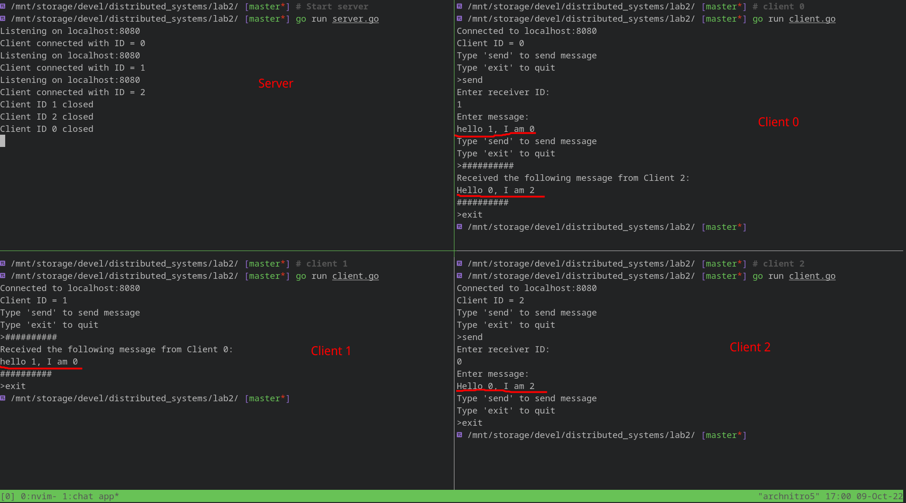

# Multi-client chat application report

## Architecture

- The clients connect to the server and each of them get a uniquely identifiable Client ID.
- The server delegates a thread to each connection with a client.
- Clients in turn use different threads to receive and send data concurrently.
- The clients can use commands like `send` and `exit`.
- `send` allows the client to send messages to another client.
- `exit` quits the client.
- Since the sending and receiving of messages are completely independent and asynchronous, the clients can receive messages from other clients at any time, even when it is busy performing another operation, similar to push notifications.
- All messages are sent to the server, which forwards the message to appropriate client.
- Messages sent from clients to server are prepended with a byte indicating the client ID of the intended receiver.
- If there is an error when forwarding a message, e.g. if the receiver client ID is invalid or the client is down, the server sends back an error message to the sender client with the first byte as its own client ID, which helps clients identify that the message received was sent by the server and not by any other client.
- A hash map with key as client ID and value as TCP connection object is maintained globally on the server side to uniquely identify all connected clients.
- The server logs some critical operations like clients connecting and messages being sent.

## Instructions

- Start the server with `go run server.go`.
- Start the clients on different tabs/terminals with `go run client.go`.
- Follow instructions on screen to send messages to other clients.

## Screenshot

## Author

- Yuvraj Mishra
- 19XJ1A0576
